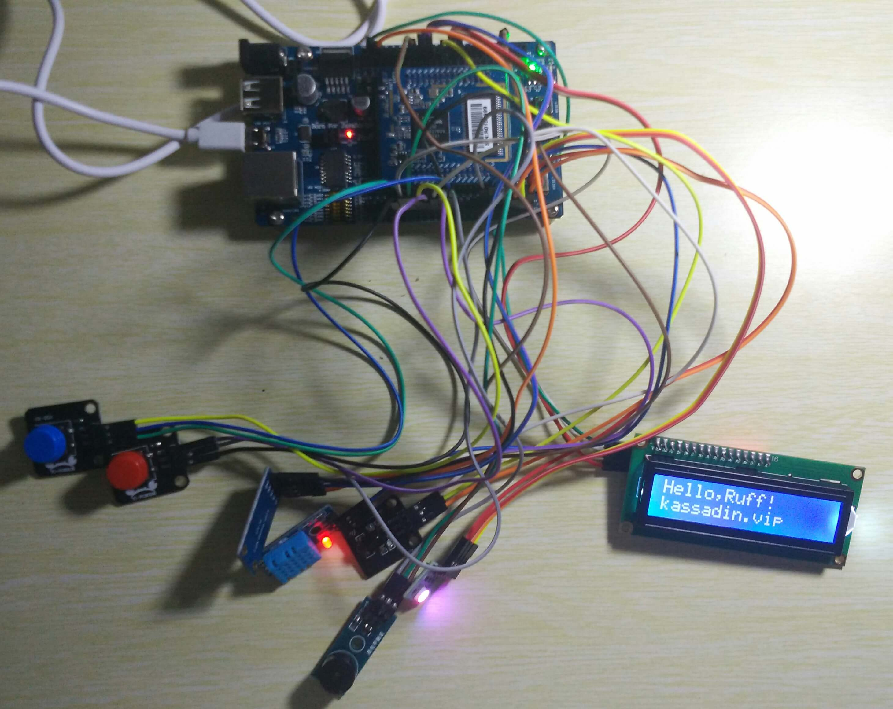
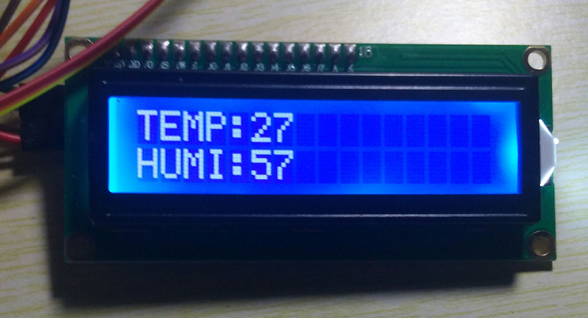
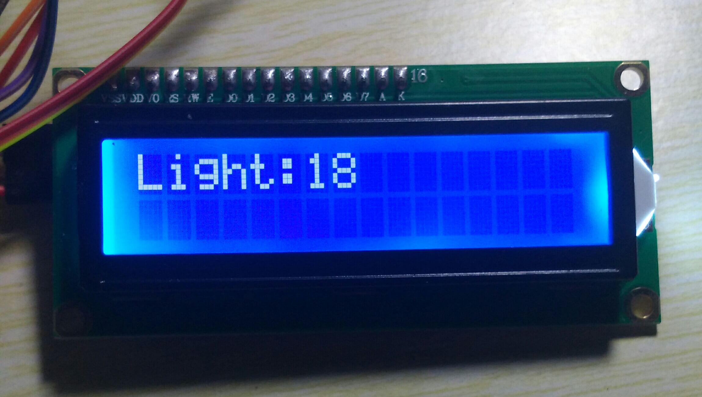

# RuffLabs

## allinone

0. Start app to show welcome and colorful light.
1. Press red button to print temperature and humidity to lcd with buzzer.
2. Press blue button to print illuminance to lcd.
3. Use any IR Transmitter to turn on/off lcd and light.

