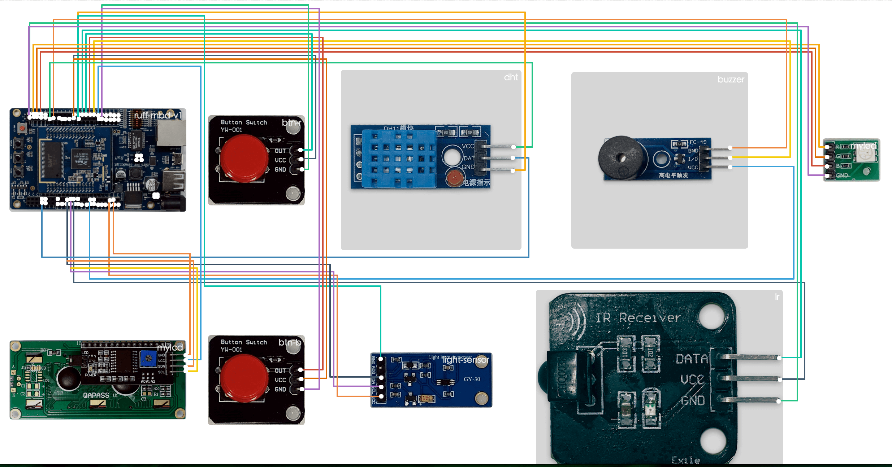

# Ruff Device All In One

## rap device list

* btn-r
  model: CK002
  driver: button-gpio@2.0.1
* btn-b
  model: CK002
  driver: button-gpio@2.0.1
* dht
  model: DHT11
  driver: dht11@0.3.0
* light-sensor
  model: GY-30
  driver: gy-30@3.0.0
* buzzer
  model: FC-49
  driver: buzzer-gpio@0.2.0
* ir
  model: IRR-01
  driver: ruff-v1-infrared-receiver@0.3.1
* myled
  model: KY-016
  driver: ky-016@2.0.0
* mylcd
  model: LCD1602-02
  driver: lcd1602-pcf8574a-hd44780@0.2.1

## rap layout --visual

